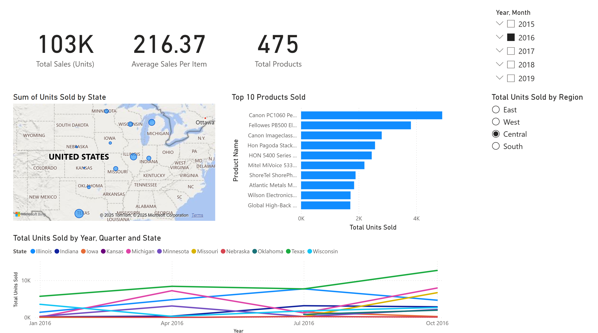

# 📊 Sales Forecasting Dashboard – Power BI

This project presents an interactive **Sales Dashboard** built using Power BI.  
It explores regional and product-level sales trends using the [Kaggle Sales Forecasting dataset](https://www.kaggle.com/datasets/rohitsahoo/sales-forecasting).

---

## 📁 Dataset
The dataset contains daily sales for multiple items across regions and states:
- Date
- State
- Region
- Product
- Units Sold

---

## 📈 Dashboard Features
- 📅 **Time-based Analysis**: Daily and monthly sales trends.
- 🌍 **Geographic Breakdown**: Sales by state and region slicers.
- 🔝 **Top Items**: Most popular products.
- 🧮 **KPI Cards**: Total units sold, average daily sales.

---

## 🚀 Tools Used
- Power BI
- DAX Measures
- Power Query
- GitHub

---

## 📦 How to Use
- Clone/download the repo
- Open the `.pbix` file using Power BI Desktop

---

## 🧠 Learnings
- Power BI data modeling
- Creating dynamic visuals with DAX
- Designing clean, user-friendly dashboards

---

## 🔗 Dataset Source
[Kaggle – Sales Forecasting Dataset](https://www.kaggle.com/datasets/rohitsahoo/sales-forecasting)

